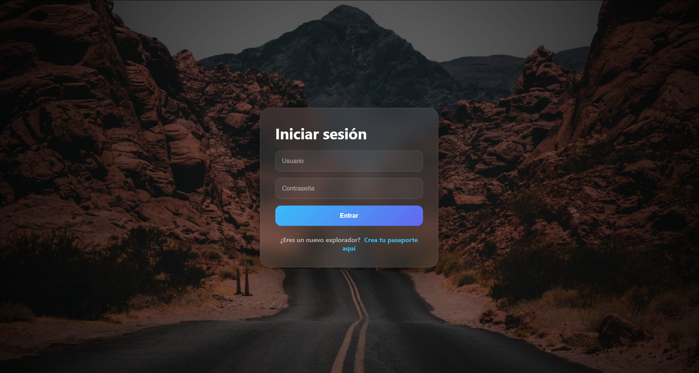
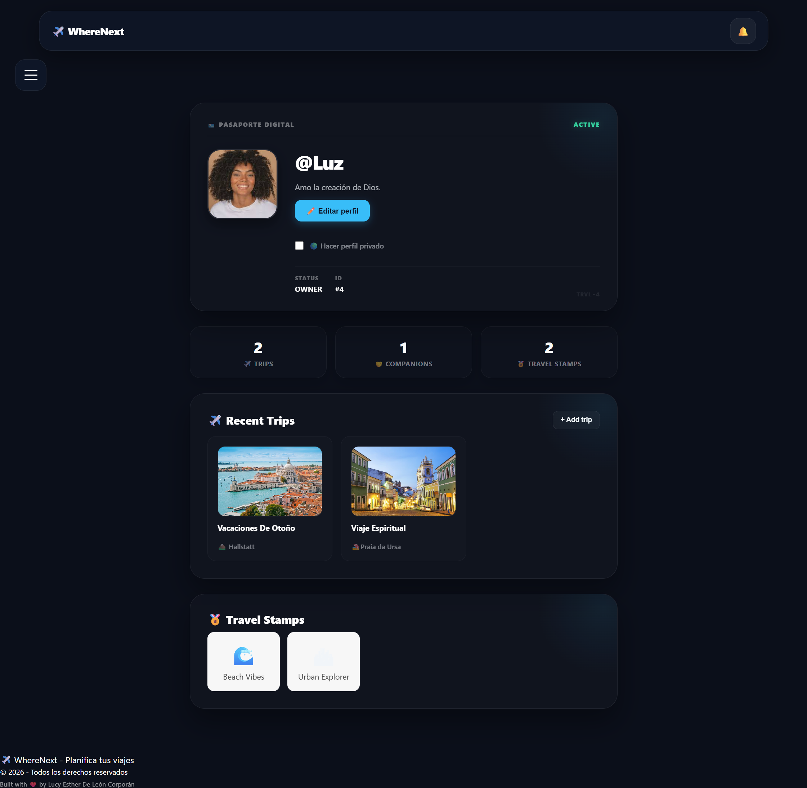
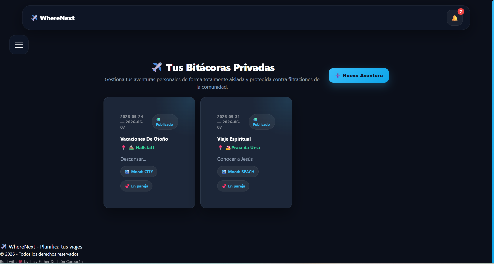
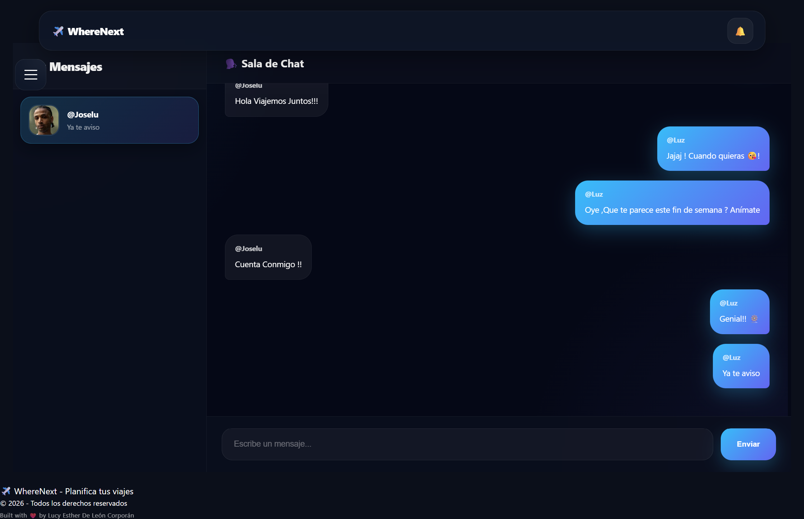
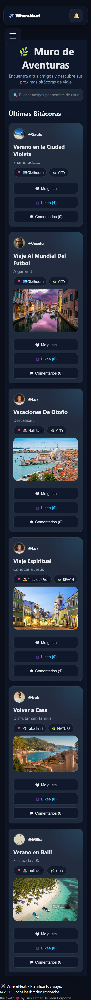
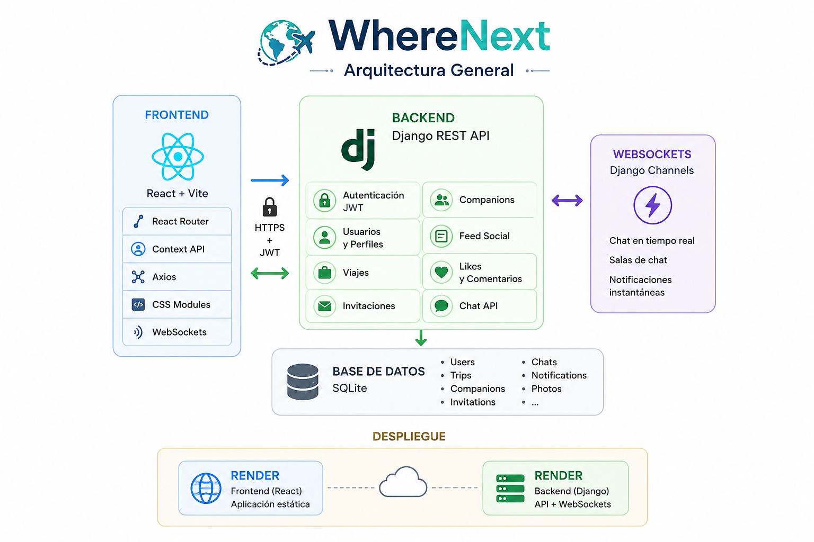

# 🌍 WhereNext

## Plataforma colaborativa para organizar viajes


✈️ Explora · 🤝 Comparte · 🌎 Conecta · 🧳 Viaja

Planifica, descubre y comparte experiencias de viaje en un solo lugar.

---

## 🎥 Demo en vídeo

https://youtu.be/20Vlv-Rmy0k

---

## 📚 Documentación Oficial

Toda la documentación del proyecto está disponible dentro del repositorio, en la carpeta `docs/`.

### 📘 Manual Técnico

[Ver Manual Técnico](docs/manual_tecnico.pdf)

### 📄 Manual de Usuario

[Ver Manual de Usuario](docs/manual_usuario.pdf)

### 🎬 Guion del Vídeo Demo

[Ver Guion del Vídeo](docs/guion_video_demo.pdf)

### 📄 Memoria completa del proyecto

Disponible en Google Drive:

https://docs.google.com/document/d/1hwzKJa_mjWAMLgb93fjRlPvE0dXNJgfTZYP6wlO7g2U/edit?usp=sharing

---

## 🌐 Aplicación en Producción

WhereNext está desplegado en Render con servicios independientes para frontend y backend.

### 🔵 Frontend (React)

https://wherenextpmf-1.onrender.com/

### 🟢 Backend (Django API)

https://wherenextpmf.onrender.com/api/trips/

> La ruta `/api/` no existe como endpoint directo.
>
> Se utiliza `/api/trips/` para verificar que la API está funcionando correctamente.

---

## 📡 Comunicación Frontend → Backend

```env
VITE_API_URL=https://wherenextpmf.onrender.com
```

## 🛠️ Tecnologías

- React
- Django
- Django REST Framework
- SQLite (desarrollo)
- PostgreSQL (producción)
- JWT Authentication
- WebSockets
- Render
- Cloudinary

---

## 📋 Tabla de Contenidos

- ✨ Sobre el Proyecto
- 🎯 Problema que Resuelve
- 🚀 Funcionalidades
- 🛠️ Stack Tecnológico
- 📸 Capturas
- 🏗️ Arquitectura
- ⚙️ Instalación
- 🔑 Variables de Entorno
- 🌐 API
- 🔒 Seguridad
- 🗺️ Roadmap
- 👩🏽‍💻 Autora

---

# ✨ Sobre el Proyecto

WhereNext es una plataforma Full Stack diseñada para simplificar la organización de viajes en grupo.

Centraliza toda la experiencia de planificación en un único lugar:

- Explorar destinos
- Crear viajes
- Gestionar companions
- Chatear en tiempo real
- Compartir experiencias

---

# 🎯 Problema que Resuelve

Organizar un viaje implica usar demasiadas herramientas:

```text
WhatsApp + Google Maps + Notas + Fotos + Calendario + Emails
```

Esto genera:

- Información dispersa
- Mala coordinación
- Duplicación de tareas
- Pérdida de contexto

WhereNext unifica todo en una sola plataforma.

---

# 🚀 Funcionalidades

## ✔️ Completadas

- Sistema de viajes
- Invitaciones y companions
- Chat en tiempo real
- Álbum de fotos
- Privacidad de perfiles y viajes
- Feed social
- Likes y comentarios

### ✈️ Gestión de Viajes

- Crear viajes
- Editar viajes
- Eliminar viajes
- Configurar privacidad
- Gestionar participantes

### 🌍 Exploración

- Descubrir lugares
- Explorar viajes públicos
- Inspiración para futuros viajes

### 💬 Chat en tiempo real (WebSockets)

- WebSockets
- Actualización instantánea

El sistema de mensajería en tiempo real está implementado mediante Django Channels y protocolo WebSocket.

La funcionalidad ha sido desarrollada, integrada y probada correctamente en entorno local utilizando un servidor ASGI.

El problema no es que Render no soporte WebSockets, sino que un chat con Django Channels necesita una infraestructura de producción más completa: servidor ASGI, conexión segura wss://, channel layer con Redis y manejo de reconexión. En el plan gratuito estas conexiones no son suficientemente estables para considerarlo producción.

No obstante, todo el código, arquitectura y lógica de comunicación en tiempo real forman parte del proyecto y pueden ejecutarse localmente iniciando el servidor ASGI:

```bash
uvicorn config.asgi:application --reload --port 8000
```

---

# 🛠️ Stack Tecnológico

## Frontend

| Tecnología | Uso |
|------------|-----|
| React | UI |
| React Router | Navegación |
| Axios | API |
| Context API | Estado global |
| CSS Modules | Estilos |
| WebSockets | Tiempo real |

---

## Backend

| Tecnología | Uso |
|------------|-----|
| Django | Framework |
| Django REST Framework | API REST |
| SimpleJWT | Autenticación |
| Django Channels | WebSockets |
| Pillow | Imágenes |
| SQLite | Desarrollo |
| PostgreSQL | Producción |
| Cloudinary | Almacenamiento de imágenes|

---

## DevOps

| Herramienta | Uso |
|------------|-----|
| GitHub | Control de versiones |
| Render | Deploy |
| Variables de entorno | Seguridad |

---

# 📸 Capturas

## 🏠 Home



---

## 👤 Perfil



---

## ✈️ Viajes



---

## 💬 Chat



---

## 📱 Responsive



---

# 🏗️ Arquitectura



## Flujo General

```text
React (Frontend)
        ↓
Django REST API
        ↓
SQLite (Desarrollo)
PostgreSQL (Producción)
        ↓
Django Channels (WebSockets)
```

---

# ⚙️ Instalación

## 1️⃣ Clonar repositorio

```bash
git clone https://github.com/Lucy-nube/whereNextPMF.git

cd whereNextPMF
```

---

## 2️⃣ Backend

```bash
cd whereNext-backend

python -m venv venv

source venv/bin/activate
# Windows:
# venv\Scripts\activate

pip install -r requirements.txt

python manage.py migrate

python manage.py runserver
```

Servidor local:

```text
http://localhost:8000
```

---

## 3️⃣ Frontend

```bash
cd whereNext-frontend

npm install

npm run dev
```

Aplicación:

```text
http://localhost:5173
```

---

# 🔑 Variables de Entorno

## Backend

```env
SECRET_KEY=your_secret_key

DEBUG=False

ALLOWED_HOSTS=localhost,127.0.0.1
```

> Render genera la URL de PostgreSQL, pero debes añadir manualmente DATABASE_URL en el servicio backend copiándola desde el panel de la base de datos.

---

## Frontend

```env
VITE_API_URL=http://localhost:8000
```

---

# 🌐 API

## Autenticación

```http
POST /api/auth/register/
POST /api/auth/login/
POST /api/auth/token/refresh/
```

---

## Viajes

```http
GET    /api/trips/
POST   /api/trips/
PATCH  /api/trips/:id/
DELETE /api/trips/:id/
```

---

## Invitaciones

```http
GET  /api/trip-invites/
POST /api/trip-invites/

POST /api/invites/trip-invites/:id/accept/
POST /api/invites/trip-invites/:id/decline/
```

---

## Chat

```http
GET /api/chats/

WS /ws/chat/:room_id/
```

---

# 🔒 Seguridad

- JWT Authentication
- Permisos por endpoint
- Validaciones backend y frontend
- Protección XSS
- Hashing seguro de contraseñas
- La aplicación se sirve sobre HTTPS gracias a Render

---

# 🗺️ Roadmap

- [ ] Viajes grupales
- [ ] Recomendaciones con IA
- [ ] Álbum colaborativo
- [ ] Calendario compartido
- [ ] Mapa interactivo
- [ ] Notificaciones en tiempo real
- [ ] Modo oscuro
- [ ] Geolocalización
- [ ] Roles por viaje

---

# 👩🏽‍💻 Autora

## Lucy Esther De León Corporán

**Full Stack Developer**

Responsable de:

- UX/UI
- Arquitectura Frontend
- Arquitectura Backend
- Modelado de datos
- Companions & Invitaciones
- Chat en tiempo real
- Seguridad
- Deploy y DevOps

### Tecnologías

```text
React • Django • PostgreSQL • JWT • WebSockets • Cloudinary • Render
```

---

# 📄 Licencia

Proyecto desarrollado con fines académicos.

© 2026 Lucy Esther De León Corporán

---

# 🙏 Agradecimientos

A Dios, al equipo docente del Máster y a la comunidad de desarrolladores.

---

# 🌟 WhereNext

**El viaje comienza mucho antes de despegar.**

Si te gusta este proyecto, considera darle una ⭐ al repositorio.